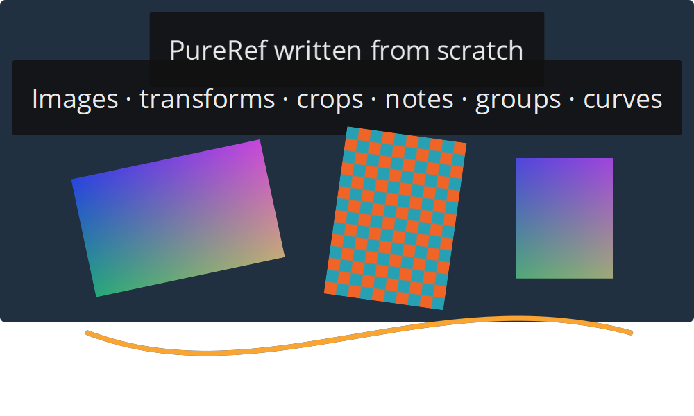

# pur-2-file-format

An independent parser, format specification, and from-scratch writer for PureRef
2.1 `.pur` files. Verified against **PureRef 2.1.3 on Windows**.



The [demo canvas](examples/standalone-demo.pur) was created entirely in Python,
including its image pixels. Writing files requires no PureRef installation, Qt,
template canvas, or third-party Python dependencies.

## What works

- Embedded PNG/JPEG images with shared resources.
- Position, rotation, scaling, opacity, and rectangular cropping.
- Unicode HTML notes and colored backgrounds.
- Groups and nested parent relationships.
- Solid line and cubic Bézier drawings.
- File inspection, image extraction, SQLite unpacking, and repacking.

The [format specification](FORMAT.md) documents the displaced SQLite container,
MD5 checksum, exact [SQL schema](schema.sql), serialized Qt values, and evidence
behind each interpretation.

## Install

Python 3.11+ with SQLite serialization support is required.

```sh
git clone https://github.com/Vacyyyy/pur-2-file-format.git
cd pur-2-file-format
python -m pip install .
```

The module can also be used directly as `python pureref2.py` without installation.

## Command line

```sh
pureref2 create new-board.pur photo.jpg drawing.png
pureref2 inspect new-board.pur
pureref2 extract new-board.pur extracted-images
pureref2 unpack new-board.pur new-board.sqlite
pureref2 pack new-board.sqlite repacked-board.pur
python -m examples.demo standalone-demo.pur
```

Output files are created exclusively: existing files are not overwritten. `pack`
computes a new checksum and writes an empty thumbnail by default. For byte-exact
repacking, use `wrap` with the original thumbnail and application version.

## Python API

```python
from pureref2 import Scene, PurFile

scene = Scene()
group = scene.group(name="References", x=100, y=50)
scene.image("photo.jpg", parent=group, x=0, y=0, rotation=15,
            scale_x=0.5, scale_y=0.5, opacity=0.8)
scene.image("drawing.png", parent=group, x=250, y=0,
            clip=(0, 0, 100, 100))
scene.note("Unicode notes: Ω 中", parent=group, x=0, y=-100)
scene.drawing([[(0, 0, 120), (1, 300, 120)]], parent=group,
              rgba=(255, 100, 20, 255), width=4)
scene.write("generated.pur")

board = PurFile.read("generated.pur")
print(board.inspect())
raw_items = board.rows("items")
sqlite_bytes = board.database
board.close()
```

Image positions locate their original centers; object transforms are relative
to their parent. `image_data` accepts encoded bytes and explicit dimensions for
other formats, but only PNG/JPEG are integration-tested. The reader loads files
into memory. `inspect` returns a readable summary; raw rows/database bytes retain
data that specialized decoders do not interpret.

## Tests and investigation

```sh
python -m unittest discover -s tests -v
python -m investigation.validate
```

Unit tests run without PureRef. Integration tests use the installed application;
set `PUREREF_EXE` to override its executable path. They use isolated settings and
synthetic files only.

Verified: eight unit tests, ten byte-exact fixture repacks, identical app-rendered
image canvases, all four item classes, crop equivalence, nested groups, and JPEG
preservation. Historical fixtures and experiments live in
[`investigation/`](investigation/README.md), with a
[validation summary](investigation/VALIDATION.json).

## Scope

This is an experimental implementation of the tested **2.1.3 subset**, not a
complete mapping of all 2.x features. Other versions, linked resources, animation,
filter flags, comments, alternate note/group modes, arbitrary BigRational values,
and non-default drawing options remain unverified. The specification marks those
gaps explicitly. This project is independent of PureRef.
